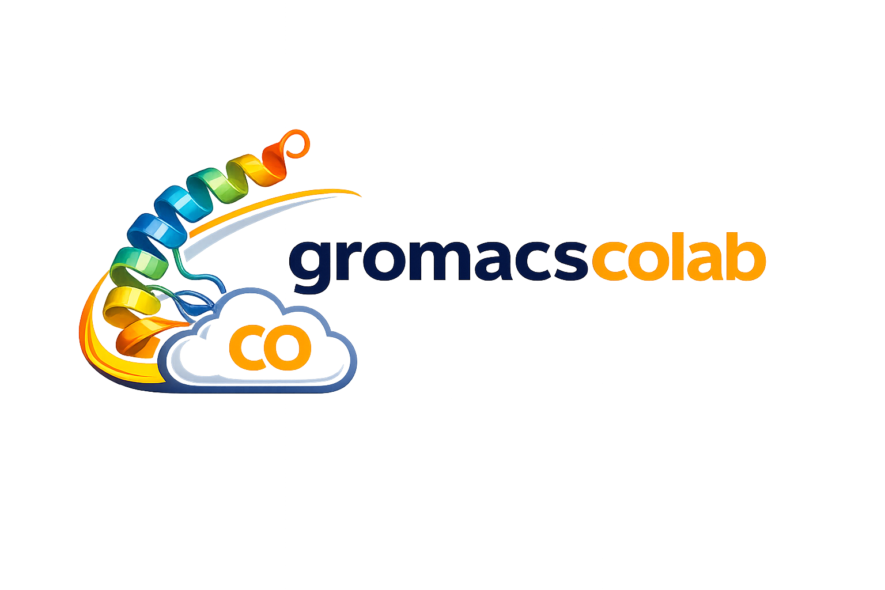

  

<h1 align="left">gromacscolab</h1>

**gromacscolab** is a set of notebooks to prepare, execute and analyze molecular dynamics simulations of proteins using Gromacs on Google Colab.
Here is a graphical summary of what it can do for you:

## Credits
- Mustafa TEKPINAR — Project Lead
- Ceylan SARİ — Developer
